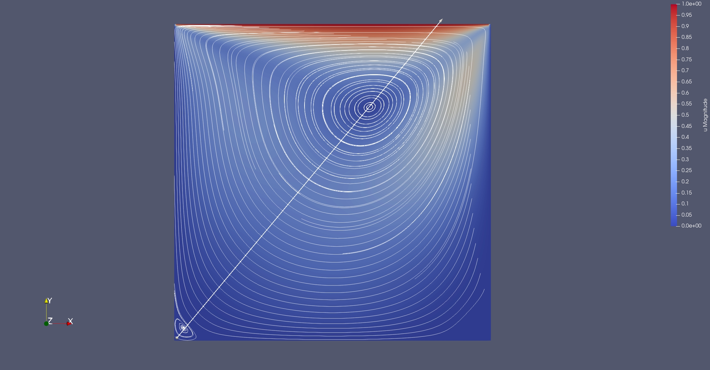
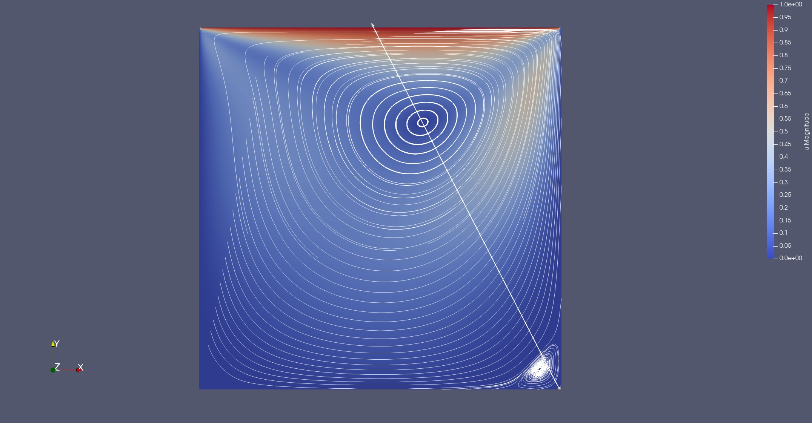

# MVP_CFD

A numerical solver in C++ for the incompressible Navier Stokes, Burgers and advection-diffusion equations, currently supporting 1D and 2D formulations. Designed as a modular, extensible framework validated on the lid-driven cavity benchmark against Ghia et al.

## Features

### Spatial Schemes
| Scheme | Order | Notes |
|--------|-------|-------|
| Central Difference | 2nd | May produce spurious oscillations at high Pe |
| Upwind | 1st | Stable and monotone, recommended for advection-dominated flows |
| QUICK | 3rd | Higher accuracy, less artificial diffusion |

### Time Schemes
| Scheme | Order | Notes |
|--------|-------|-------|
| Explicit Euler | 1st | Simple, subject to CFL and diffusion stability limits |
| Runge-Kutta 4 | 4th | High accuracy, recommended for precision simulations (not yet available for INCOMPRESSIBLE_NS_2D) |

### Boundary Conditions
- **Dirichlet** — fixed value at boundaries
- **Neumann** — fixed derivative at boundaries
- **Periodic** — u(0) = u(L)

### Initial Conditions
- **Gaussian** — smooth bell-shaped profile 		(1D only)
- **Square wave** — sharp step profile				(1D & 2D)
- **Sinusoidal** — smooth periodic oscillations		(1D only)
- **Constant** — constant value across the domain 	(1D & 2D)

## Stability analysis

Every numerical scheme evolves the discrete solution step by step. Together with the solution, the errors evolve too: truncation errors, floating point round-off, perturbations. Since the scheme is the same for both the solution and the error, it is necessary to establish if the scheme amplifies or damps the errors and under which conditions. This is determined by conducting the von Neumann analysis, which decomposes the error into elementary Fourier waves and evaluates the amplification factor that multiplies each wave at every step: the scheme is stable only if no wave can grow.

The analysis retrieves the conditions under which the schemes are stable. The dimensionless numbers coming from the analysis are listed below. These numbers have a direct physical interpretation which helps understand their meaning. All the numbers are presented for the 1D case for simplicity, but the concepts extend to higher dimensions and to the different schemes (the scheme-by-scheme summary is at the end of this section).

### Courant-Friedrichs-Lewy (CFL)
```
CFL = c·Δt/Δx ≤ 1 
```

The CFL number comes from the advection term. This number has a clear physical meaning: the physical information moves by c·Δt at every time step Δt. The CFL condition imposes that the distance traveled by the physical information (c·Δt) must not exceed the grid spacing Δx: if it does, the exact solution depends on information that the numerical stencil can't even see, and no explicit scheme can converge. This is in practice a constraint on the time step: a fine grid is adopted to have a better accuracy, but a large time step is also desirable to reduce the computational cost. This condition poses a limit on the time step, which needs to be small enough for the scheme to be stable.

### Diffusion Number
```
d = D·Δt/Δx² ≤ 0.5
```

The diffusion number comes from the viscous term and measures how far diffusion spreads information in one time step compared to the cell size. If d > 0.5 the shortest wave the grid can represent (the two-cell zig-zag mode) is amplified with alternating sign at every step, producing the classic oscillating blow-up. Note that the limit scales with Δx²: halving the grid spacing costs a factor 4 on the time step, so explicit diffusion becomes the dominant constraint on fine grids.

### Coupled advection-diffusion limit
```
Δt ≤ 2·D/c²        (CENTRAL scheme)
```

CFL and diffusion number are not two independent checks: the von Neumann analysis of the full advection-diffusion scheme couples them. The centered advection scheme alone (with explicit Euler) is unconditionally unstable — no time step can save it — and it is the physical diffusion that stabilizes it. This coupled condition quantifies how much diffusion is needed. Interestingly, it does not depend on Δx at all.

### Peclet Number
```
Pe      = c·L/D              (global)
Pe_cell = c·Δx/D ≤ 2         (cell, for CENTRAL)
```

The global Peclet number classifies the physical regime of the problem:
- Pe << 1 — diffusion dominated
- Pe >> 1 — advection dominated
- Pe ~ 1 — mixed regime

The cell Peclet number is its grid-level version and, unlike the numbers above, it is not a time step limit but a spatial quality condition: with the CENTRAL scheme, if Pe_cell > 2 the steady solution develops non-physical node-to-node oscillations (wiggles). The UPWIND scheme never oscillates (at the price of extra numerical diffusion), while QUICK tolerates larger Pe_cell with much less artificial diffusion. The two Peclet numbers are linked by Pe_cell = Pe·(Δx/L): refining the grid lowers Pe_cell without changing the physics.

### Stability conditions per scheme (2D, explicit Euler)

| Scheme | Stability conditions |
|--------|---------------------|
| CENTRAL | d_x + d_y ≤ 1/2  and  Δt ≤ 2D/(c_x²+c_y²) |
| UPWIND  | C_x + C_y + 2(d_x + d_y) ≤ 1 |
| QUICK   | C_x²/d_x + C_y²/d_y ≤ 2  and  C_x + C_y + 4(d_x + d_y) ≤ 2 |

where C_i and d_i are the per-direction CFL and diffusion numbers. For the incompressible Navier-Stokes solver the pressure/projection step is non-expansive (it cannot amplify any error mode), so the stability conditions are those of the advection-diffusion predictor with c = max|u| over the domain. With RK4 the limits above are conservative: RK4 has a larger stability region (in particular, CENTRAL advection alone becomes stable up to C ≈ 2.8).

## Validation

The incompressible Navier-Stokes solver is validated against the reference solution of Ghia et al. [6] for the lid-driven cavity flow at Re = 100.

**Setup**: unit square cavity, 129×129 grid, U_lid = 1, ν = 0.01 (Re = 100), QUICK scheme, explicit Euler with Δt = 10⁻³, homogeneous Neumann pressure BCs on all walls, run to steady state (t = 20 sec, n° of time iteration = 20000).

The comparison is performed on the u-velocity profile along the vertical centerline x = 0.5 and horizontal centerline y = 0.5, against the 17 tabulated values of Ghia's Table I (note that Ghia et al. solve the same physical problem with a completely different method — streamfunction-vorticity with multigrid — which makes the agreement a cross-validation between independent methods):

Table I — u-velocity on the vertical centerline x = 0.5:

| y | u (Ghia) | u (MVP_CFD) | Δu (% of U_lid) |
|--------|----------|-------------|-----------------|
| 1.0000 |  1.00000 |  1.00000 | 0.000 |
| 0.9766 |  0.84123 |  0.84252 | 0.129 |
| 0.9688 |  0.78871 |  0.79042 | 0.171 |
| 0.9609 |  0.73722 |  0.73934 | 0.212 |
| 0.9531 |  0.68717 |  0.68967 | 0.250 |
| 0.8516 |  0.23151 |  0.23434 | 0.283 |
| 0.7344 |  0.00332 |  0.00337 | 0.005 |
| 0.6172 | -0.13641 | -0.13631 | 0.010 |
| 0.5000 | -0.20581 | -0.20375 | 0.206 |
| 0.4531 | -0.21090 | -0.20807 | 0.283 |
| 0.2813 | -0.15662 | -0.15309 | 0.353 |
| 0.1719 | -0.10150 | -0.09895 | 0.255 |
| 0.1016 | -0.06434 | -0.06271 | 0.163 |
| 0.0703 | -0.04775 | -0.04541 | 0.234 |
| 0.0625 | -0.04192 | -0.04088 | 0.104 |
| 0.0547 | -0.03717 | -0.03625 | 0.092 |
| 0.0000 |  0.00000 |  0.00000 | 0.000 |

Maximum deviation on u: 0.353% of the lid velocity

Table II — v-velocity on the horizontal centerline y = 0.5:

| x | v (Ghia) | v (MVP_CFD) | Δv (% of U_lid) |
|--------|----------|-------------|-----------------|
| 1.0000 |  0.00000 |  0.00000 | 0.000 |
| 0.9688 | -0.05906 | -0.06113 | 0.207 |
| 0.9609 | -0.07391 | -0.07640 | 0.249 |
| 0.9531 | -0.08864 | -0.09148 | 0.284 |
| 0.9453 | -0.10313 | -0.10629 | 0.316 |
| 0.9063 | -0.16914 | -0.17303 | 0.389 |
| 0.8594 | -0.22445 | -0.22761 | 0.316 |
| 0.8047 | -0.24533 | -0.24625 | 0.092 |
| 0.5000 |  0.05454 |  0.05705 | 0.251 |
| 0.2344 |  0.17527 |  0.17472 | 0.055 |
| 0.2266 |  0.17507 |  0.17449 | 0.058 |
| 0.1563 |  0.16077 |  0.16004 | 0.073 |
| 0.0938 |  0.12317 |  0.12248 | 0.069 |
| 0.0781 |  0.10890 |  0.10827 | 0.063 |
| 0.0703 |  0.10091 |  0.10032 | 0.059 |
| 0.0625 |  0.09233 |  0.09178 | 0.055 |
| 0.0000 |  0.00000 |  0.00000 | 0.000 |

Maximum deviation on v: 0.389% of the lid velocity

Overall maximum deviation: 0.389% of the lid velocity

### Lid-drive cavity flow streamlines images: 




## Build

The project uses a Makefile with three build configurations:

```bash
make                  # Release build (optimized, -O3)
make BUILD=debug      # Debug build (-g, no optimization)
make BUILD=asan       # AddressSanitizer build (memory/UB checks)
```

Executables produced:
- `solver` — release
- `solver_debug` — debug
- `solver_asan` — asan

```bash
make run              # Build (release) and run with config.cfg
make clean            # Remove objects and executables
make cleanall         # Also remove output files
make help             # Show all available targets
```

## Usage

The quickest way to run is:
```bash
make run
```

This builds the project (if needed) and runs it automatically with an example setup which is the lid-driven cavity flow at Re=100 used in the validation. To use a different config file, run the executable directly:

```bash
./solver <config_file>
# example:
./solver configs/AdvDiff1D.cfg
```

To perform a dry run (only set up of the simulation without actually running it), "dry" keyword has to be placed after the config_file name:

```bash
./solver <config_file> dry
```

To see all the possible build options:

```bash
make help
```

### Usage Guidelines

Best practice to keep the folders clean. Always run the solver from the base folder, and save the results separately in the results folder. Therefore, all configuration files should remain in the configs folder. The call should be:

```bash
./solver configs/<config_filename>.cfg
```

The results folder specified in the config file should be:

```ini
OUTPUT_DIR = results/<output_filename>
```

To improve workspace organization, it is suggested to have the same name for the <config_filename> and for the <output_filename>.


## Configuration File

The solver is fully configured via a `.cfg` text file. Lines starting with `#` are comments.

```ini
# MVP CFD Solver — Example Configuration
# Setup for the standard lid-driven cavity validation case (Re = 100).

# Solver type
SOLVER = INCOMPRESSIBLE_NS_2D 	 			# ADVECTION_DIFFUSION_1D | ADVECTION_DIFFUSION_2D | BURGERS_2D | INCOMPRESSIBLE_NS_2D

# Grid options
GRID_POINTS_X = 129
GRID_POINTS_Y = 129
DOMAIN_LENGTH_X = 1.0
DOMAIN_LENGTH_Y = 1.0

#Physical settings
DIFFUSION_COEFF = 0.01
DENSITY = 1.0

# Simulation settings
TIME_STEP = 0.001
INITIAL_TIME = 0.0
END_TIME = 3.0

# PPE settings only for INCOMPRESSIBLE_NS_2D
PPE_MAX_ITER = 2000 
# PPE_TOLL_TYPE defines how PPE_TOLERANCE is interpreted by the solver. It can be:
# D (divergence tolerance): PPE_TOLERANCE is the maximum divergence accepted on the
#   corrected velocity field. The solver converts it internally into a residual
#   tolerance through the identity div(u) = (dt/rho) * residual. Recommended, since
#   its meaning does not depend on the time step. Typical value: 1e-4 to 1e-6.
# E (effective tolerance): PPE_TOLERANCE is used directly as the stopping threshold
#   on the PPE residual r = b - lap(p), in the units of b (i.e. rho/dt * divergence).
PPE_TOLL_TYPE = D
PPE_TOLERANCE = 1e-6

# Successive Over-Relaxation: SOR_FLAG controls the relaxation factor omega used in the
# PPE sweep. Relaxation can stabilize an iteration (omega < 1, e.g. in the SIMPLE
# algorithm) or accelerate its convergence (omega > 1, this case). It can be:
# NONE   deactivates SOR: plain Gauss-Seidel (omega = 1)
# MANUAL omega is read from the SOR_OMEGA_VALUE key (must be in (0,2))
# AUTO   omega is computed from Young's optimal formula for the Poisson stencil
SOR_FLAG = AUTO
SOR_OMEGA_VALUE = 1.9

# Spatial and Time schemes
SPATIAL_SCHEME = QUICK   			# UPWIND | CENTRAL | QUICK
TIME_SCHEME = EULER_EXPLICIT		# EULER_EXPLICIT | RK4 (RK4 not available for NS 2D)

# ============================ Initial Conditions Settings ==============================

# Possible value for INITIAL_CONDITIONS:
#   GAUSSIAN    (1D only)  → requires: AMPLITUDE_IC, X0_IC, SIGMA_IC
#   SQUARE_WAVE (1D & 2D)  → requires: AMPLITUDE_IC, BASELINE_VALUE_IC, RANGE_START_IC, RANGE_END_IC (1D)
#                                       AMPLITUDE_IC, BASELINE_VALUE_IC, RANGE_START_X_IC, RANGE_END_X_IC,
#                                                     RANGE_START_Y_IC, RANGE_END_Y_IC (2D)
#   SINUSOIDAL  (1D only)  → requires: AMPLITUDE_IC
#   CONSTANT    (1D & 2D)  → requires: AMPLITUDE_IC

INITIAL_CONDITIONS = SQUARE_WAVE

# ============================ Boundary Condition settings ==============================

# Advection-Diffusion solver (scalar field: e.g. temperature, concentration)
# Supports 1D and 2D configurations depending on grid setup
#
# Boundary condition is global (same type applied to all boundaries)
# Allowed values: DIRICHLET | NEUMANN | PERIODIC
#
# BC_* values define scalar boundary values (used only for DIRICHLET and NEUMANN)

BOUNDARY_CONDITIONS = PERIODIC  # DIRICHLET | NEUMANN | PERIODIC

BC_LEFT = 0.0
BC_RIGHT = 0.0
BC_TOP = 0.0
BC_BOTTOM = 0.0

# =======================================================================================

# Burgers equation solver (2D vector field: U, V)
# Boundary conditions are defined per face (bottom, top, left, right)
#
# Supports Dirichlet (D) and Neumann (N) boundary conditions
#
# For periodic boundary conditions, set:
#   BOUNDARY_CONDITION = PERIODIC
# In this case, periodicity overrides individual boundary type settings.
#
# Example: lid-driven configuration (top lid moving in x-direction)

BOUNDARY_CONDITIONS = DIRICHLET  # DIRICHLET | NEUMANN | PERIODIC

BOUNDARY_CONDITIONS_VALUES_U = {0.0, 1.0, 0.0, 0.0}
BOUNDARY_CONDITIONS_VALUES_V = {0.0, 0.0, 0.0, 0.0}

# =======================================================================================

# Boundary Conditions Settings for Incompressible Navier Stokes solver
# Layout: { bottom, top, left, right }
#
# BOUNDARY_CONDITIONS_VALUES_X defines the prescribed values for each boundary face.
# Example: BOUNDARY_CONDITIONS_VALUES_U = {0.0, 1.0, 0.0, 0.0}
#
# BOUNDARY_CONDITIONS_TYPES_X defines the type of boundary condition per face.
# Allowed values: Dirichlet (D), Neumann (N)
# Example: BOUNDARY_CONDITIONS_TYPES_U = {D, N, N, N}
#
# At least one Dirichlet boundary condition is required to ensure a well-posed problem
#
# For periodic boundary conditions, set:
#   BOUNDARY_CONDITION = PERIODIC
# In this case, periodicity overrides individual boundary type settings.
#
# Otherwise set:
#   BOUNDARY_CONDITIONS = MIXED
# and use BOUNDARY_CONDITIONS_TYPES_X to define D/N conditions.
#
# Example: lid-driven cavity
# Top wall moves right (u = 1.0), all other walls are no-slip (u = 0.0)

BOUNDARY_CONDITIONS_VALUES_U = {0.0, 1.0, 0.0, 0.0}
BOUNDARY_CONDITIONS_VALUES_V = {0.0, 0.0, 0.0, 0.0}
BOUNDARY_CONDITIONS_VALUES_P = {0.0, 0.0, 0.0, 0.0}

BOUNDARY_CONDITIONS_TYPES_U = {D,D,D,D}
BOUNDARY_CONDITIONS_TYPES_V = {D,D,D,D}
BOUNDARY_CONDITIONS_TYPES_P = {N,N,N,N}

BOUNDARY_CONDITIONS = MIXED

# =======================================================================================

#Output flag
VERBOSE = true

#Results
OUTPUT_DIR = results/cavity_RE_100/
OUTPUT_FILE = output
OUTPUT_FREQUENCY = 100

```

## Results and Visualization

### 1D case:
Results are saved as `.csv` files in the `results/` directory:
- `mesh.csv` — grid coordinates
- `output.csv` — solution `u` at each saved time step (one row per step)

Visualization is handled by a Python script inside the `scripts/` directory:

```bash
python3 scripts/visualize_1D_results.py
```

### 2D case:
Results are saved as `.vtu` files in the `results/` directory. The `.pvd` file is used to visualize all the results saved in the `.vtu` files.

To visualize the results, open the `.pvd` file using Paraview.


## Roadmap

- [x] 1D Advection-Diffusion solver
- [x] 2D Advection-Diffusion solver
- [x] 2D Burgers solver
- [x] Incompressible Navier Stokes equations
- [x] VTK output for Paraview

## References

1. LeVeque, R. J. (2002). *Finite Volume Methods for Hyperbolic Problems*
2. Barba, Lorena A., and Forsyth, Gilbert F. (2018). *CFD Python: the 12 steps to Navier-Stokes equations.* Journal of Open Source Education, 1(9), 21, https://doi.org/10.21105/jose.00021
3. Politecnico di Milano. *Lecture notes from university courses.*
4. Tom-Robin Teschner. *cfd.university* 
5. Chorin, A. J. (1968). *Numerical solution of the Navier-Stokes equations.*
6. Ghia et al. *High-Re Solutions for Incompressible Flow Using the Navier-Stokes Equations and a
Multigrid Method*
7. D. Levy, *Introduction to Numerical Analysis — The Von Neumann Method for Stability Analysis*

## License

Free for educational and research use.
